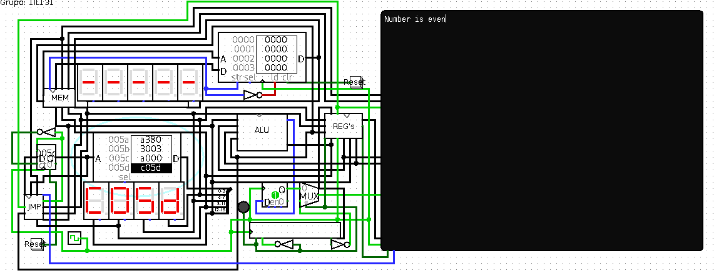

# mips 16bit compiler

## Usage
The compiler only takes as input files with .s extension and outputs .out
files.

## Example
### Input
`example.s`

```mips
li  r0,  4          # r0 = 4
li  r1,  3 	        # r1 = 3
mul r1,  r1, r0 	# r1 = r1 * r0
li  r2,  2          # r2 = 2
li  r10, 0          # r10 = 0 
rem r3,  r1, r2     # r3 = r1 % r2
eq  r3,  r10        # r3 == 0
bra even            # if true, is even
jmp odd             # else, is odd

even:
    print "Number is even"  # Prints the string
    jmp end

odd:
    print "Number is odd"   # Prints the string

end:
    jmp end 	            # Halt
```

### Output
after done compiling, `example.out` will be a text file which can be fed into
the ROM using the [Logisim's 16bit CPU](https://github.com/jaimesoad/OAC-16bit-computer).
\
Once done that, we can execute the file and this should be the expected
output:

